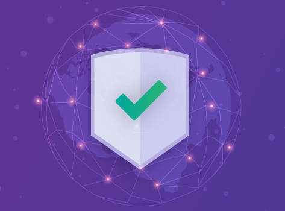
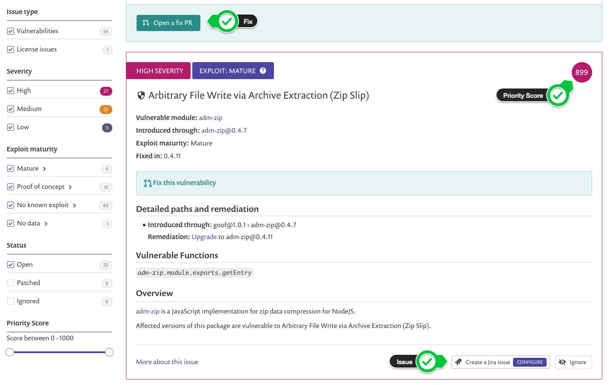

# Application Scanning

##  Background



Scanning your application for vulnerabilities in your open source dependencies begins at the source. Earlier, when we enabled the Snyk integration to Bitbucket and imported our first project we saw vulnerability counts based on our [packages.json](https://bitbucket.org/snyk/patterns-library-atlassian-aws/src/master/app/goof/package.json) as well as detailed information for each.

When you review the results in Snyk, you not only receive context such as severity and exploit maturity for your vulnerabilities. You also receive the following powerful features:



* [Fix pull request](https://support.snyk.io/hc/en-us/articles/360003891038-Fix-your-vulnerabilities) to help you fix vulnerabilities by either upgrading the direct dependencies or patching the vulnerability.
* [Priority Score](https://snyk.io/blog/snyks-developer-first-prioritization-capabilities/) to help you effectively prioritize fixes.

  The score, ranging from 1-1000, is powered by a proprietary algorithm that processes a wide array of factors, such as [CVSS](https://www.first.org/cvss/) score, the availability of a 

  fix known exploits, how new the vulnerability is, and whether it is reachable or not.

* [Jira integration](https://snyk.io/blog/jira-integration/) to enable you to create issues in Jira.

## Application scanning in your pipeline

The [bitbucket-pipelines.yml](https://bitbucket.org/snyk/patterns-library-atlassian-aws/src/192a4d2412a4330b9f634e9d45a546ec1add61fb/bitbucket-pipelines.yml#lines-15:30) file defines your Pipelines builds configuration. If you're new to Pipelines you can learn more about how to get started [here](https://support.atlassian.com/bitbucket-cloud/docs/get-started-with-bitbucket-pipelines/).

In this workshop, we have provided you with a sample [bitbucket-pipelines.yml](https://bitbucket.org/snyk/patterns-library-atlassian-aws/src/192a4d2412a4330b9f634e9d45a546ec1add61fb/bitbucket-pipelines.yml#lines-15:30) file that contains distinct steps mapped to our workflow. We will scan the application, build the Docker image, scan the container image, then deploy the application to a Kubernetes cluster. Let's take a closer look at the application scanning step:

```yaml
scan-app: &scan-app
  - step:
      name: "Scan open source dependencies"
      caches:
        - node
      script:
        - pipe: snyk/snyk-scan:0.4.3
          variables:
            SNYK_TOKEN: $SNYK_TOKEN
            LANGUAGE: "npm"
            PROJECT_FOLDER: "app/goof"
            TARGET_FILE: "package.json"
            CODE_INSIGHTS_RESULTS: "true"
            SEVERITY_THRESHOLD: "high"
            DONT_BREAK_BUILD: "true"
            MONITOR: "false"
```

In this example, we are leveraging the [Snyk Scan](https://bitbucket.org/product/features/pipelines/integrations?p=snyk/snyk-scan) pipe in our pipeline to perform a scan of our application. Our [source](https://bitbucket.org/snyk/snyk-scan) contains a complete, YAML definition of all supported variables, but only those included in this snippet are necessary for our purpose.

Let's take a closer look at a few of these:

1. `SNYK_TOKEN` is being passed into our pipe as a repository variable previously defined in the \[**Bitbucket Configuration**\]\(\) module.
2. `PROJECT_FOLDER` is the folder in which the project resides and normally defaults to `.`. However, in our example, we have set this to `app/goof` and

   are passing this as an [artifact](https://support.atlassian.com/bitbucket-cloud/docs/use-artifacts-in-steps/) to other steps in our pipeline.

3. `CODE_INSIGHTS_RESULTS` defaults to `false`. However, we will want to create [Code Insight report with Snyk](https://snyk.io/blog/enhanced-security-for-bitbucket-cloud-development/) test results so we have set this to `true`.
4. `SEVERITY_THRESHOLD` reports on issues equal or higher of the provided level. The default is `low` but in our case, we are interested only in `high` so we have defined this variable accordingly.
5. `DONT_BREAK_BUILD` the default is `false` and this is to be expected. Under normal circumstances we would want to break our build if issues our found. However, for the purpose of this learning exercise we are setting this to `true`.


You can run **Snyk security scans** on your _pull requests_ and view results in **Code Insights** with the help of a brand new [Snyk Security Connect App on the Atlassian Marketplace](https://marketplace.atlassian.com/apps/1222359/snyk-for-bitbucket-cloud?hosting=cloud&tab=overview&utm_source=partner&utm_medium=comarketing&utm_campaign=P:marketplace%7CO:ecosystem%7CF:awareness%7CC:campaign%7CH:fy20q4%7CI:synk-bbc%7C). It's easy to get started and you can install the app with just a few clicks.


