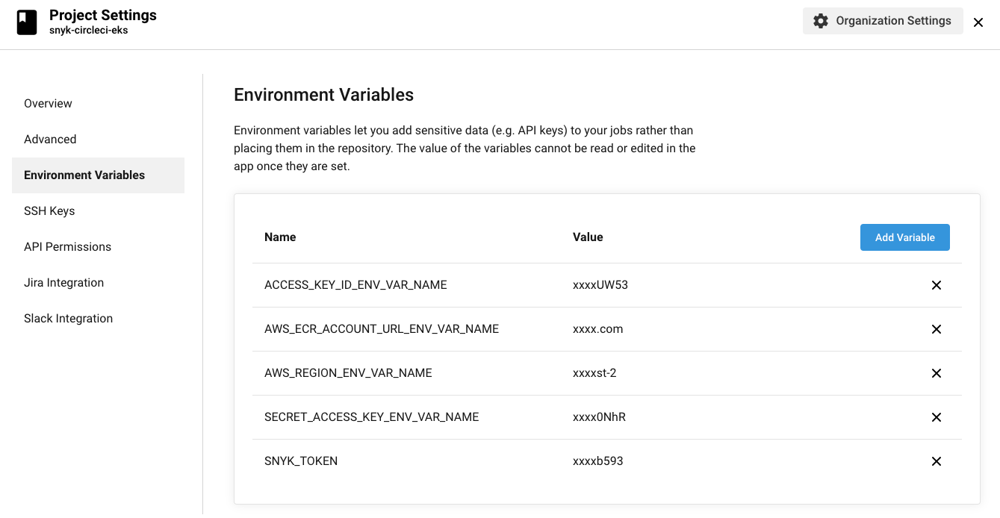

# CircleCI Configuration

If you do not yet have a [fork](https://github.com/snyk-partners/snyk-circleci-eks/fork) of the repository associated with this workshop, you should do so now. The contents of this Git repo will contain  a `.circleci/config.yml` file. A comprehensive reference document for the CircleCI 2.x configuration keys that are used in the `config.yml` file is available from [CircleCI](https://circleci.com/docs/2.0/configuration-reference/). We will reference some of the config keys in our walk-through of our sample `config.yml` file.

#### Environment variables

Throughout the examples shown in these exercises you will see references to a few environment variables. These are defined in our [CircleCI Project Settings](https://circleci.com/docs/2.0/env-vars/?utm_medium=SEM&utm_source=gnb&utm_campaign=SEM-gb-DSA-Eng-ni&utm_content=&utm_term=dynamicSearch-&gclid=EAIaIQobChMI_LT0qqj16QIVUB-tBh0J-gxoEAAYASAAEgJdxfD_BwE#setting-an-environment-variable-in-a-project) and will be referenced in our `config.yml` to allow for secure authentication between CircleCI, AWS and Snyk.

#### 

The specific variables needed are as follows:

1. AWS Identity & Access Management User [key and secret](https://docs.aws.amazon.com/IAM/latest/UserGuide/id_credentials_access-keys.html) for secure authenticated interactions with the AWS API: `ACCESS_KEY_ID_ENV_VAR_NAME` & `SECRET_ACCESS_KEY_ENV_VAR_NAME`
2. [AWS Elastic Container Registry \(ECR\) URL](https://docs.aws.amazon.com/AmazonECR/latest/userguide/Registries.html) for accessing your default registry: \(SEE WARNING BELOW\) `AWS_ECR_ACCOUNT_URL_ENV_VAR_NAME`
3. AWS region you will be deploying to: AWS\_REGION\_ENV\_VAR\_NAME
4. API token for authenticating with your Snyk account: `SNYK_TOKEN`


Ensure that you use the general ECR URL in the following format:

`https://aws_account_id.dkr.ecr.region.amazonaws.com`



It is recommended that you use [Snyk Service accounts](https://support.snyk.io/hc/en-us/articles/360004037597-Service-accounts) and [AWS IAM best practices](https://docs.aws.amazon.com/IAM/latest/UserGuide/best-practices.html) when creating accounts.


