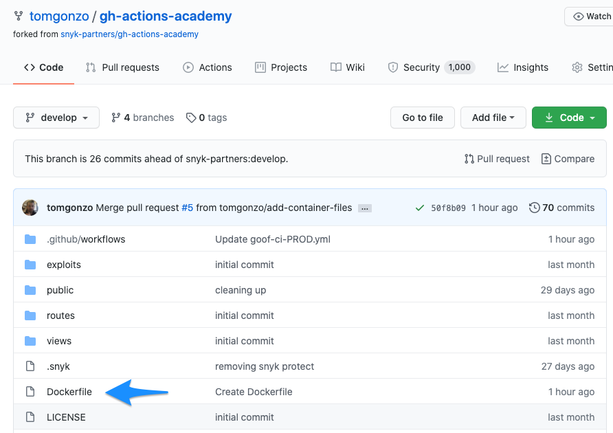
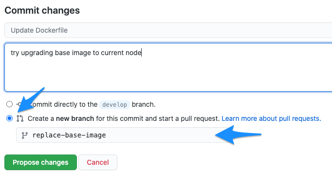
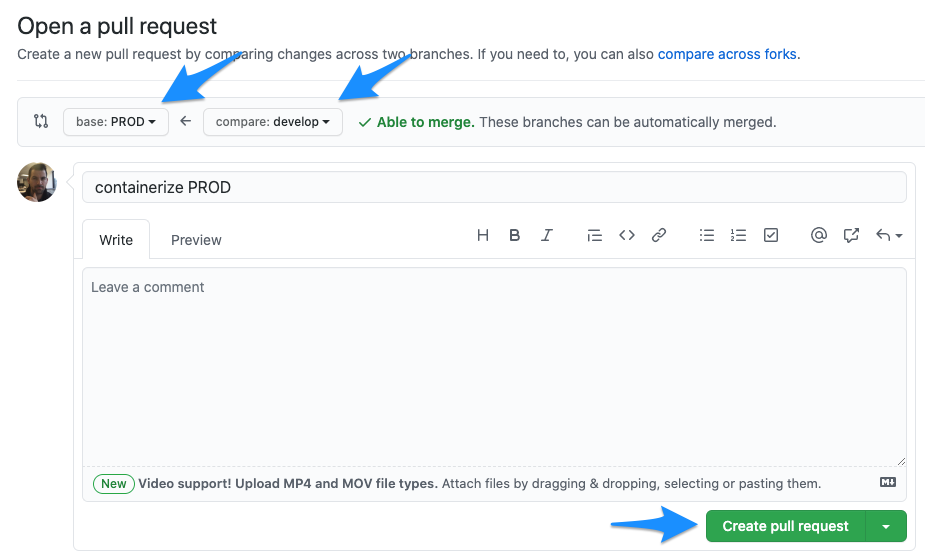
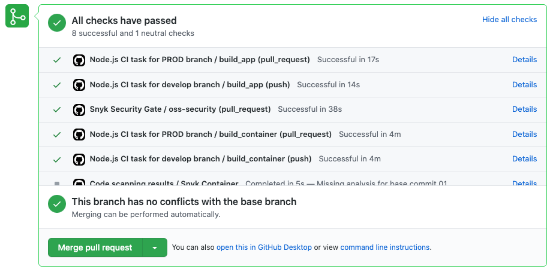

# Section 6: Secure your Container Image

In the previous section, we saw how Snyk presents other Base Images we can use with our container to remedy multiple vulnerabilities at once. In this section, we'll select a more secure base image for our container. Let's get started!

## Step 1: Modify the Dockerfile in GitHub

In GitHub, navigate to your Repo and click on the Dockerfile to open it.



Click the Edit icon to open the GitHub Web Editor.


Comment out \(or delete\) the old `FROM` statement in the Dockerfile, and add a new one from the list of Snyk's recommendations. In this example, we'll use `node:14-stretch`. Your Dockerfile should now look like this:

```text
#FROM node:6-stretch
FROM node:14-stretch

RUN mkdir /usr/src/goof
RUN mkdir /tmp/extracted_files
COPY . /usr/src/goof
WORKDIR /usr/src/goof

RUN npm update
RUN npm install
EXPOSE 3001
EXPOSE 9229
ENTRYPOINT ["npm", "start"]
```


This is an educational example. Upgrading from Node 6 to Node 14 won't always work for your application. Outside of this Lab, you need to understand your application and its dependencies when selecting a base image, as it isn't guaranteed to work when jumping versions like this. 


When ready to Commit the changes, select the option to create a **new branch** for this commit and propose the changes to the `Dockerfile`.



In the next view, go ahead and create the Pull Request.


## Step 2: Verify that the CI job completes successfully

In the Pull Request view, make sure your application and container build successfully on top of the new base image by ensuring the `build-container` check completes successfully.


When ready, merge the Pull Request to bring our changes into `develop` and delete the `replace-base-image` branch when done.

## Step 3: Review the new Vulnerability Scan results

With our new Base Image in place, we can review the vulnerability scan results from Snyk Container once again to see what vulnerabilities we have left to triage in our container image.

### GitHub Security Code Scanning

You can review  vulnerability counts in GitHub Security Code Scanning, as shown in the previous section. 


Results in Security Code Scanning take time to update. You won't see updated vulnerability counts until the CI Workflow completes after code has been merged into `develop`. 


### Snyk UI

In the Snyk UI, the results for the Dockerfile update automatically once the changes are merged into the default working branch. We can see that simply by changing the base image we used, we went from 836 issues to 307! Now we only have 35 high severity vulnerabilities to triage, as opposed to the 203 from before.


## Step 4: Merge the changes to PROD

We have outstanding vulnerabilities to take care of, but we need to push our changes to PROD in order to sustain the pace of delivery. We feel good about what we push to PROD, since it's a best effort progressing delivery while keeping the workload secure. 

Let's open a PR from `develop` to `PROD` to check in our work for the day.



Once all checks pass, go ahead and merge the PR. Hooray! Our container is now PROD-ready! 



#### Wait a minute, what about our Snyk Gate?

In Part 1, we added a Snyk gate that prevents high-severity vulnerabilities from entering our PROD branch, so why can we merge to PROD even though high severity vulnerabilities are present?

In short, we opted to not add container vulnerabilities to the Snyk gate. It still evaluates application vulnerabilities, but in order to not overburden our developers, we opted to not implement it for our container base image. 

## Recap & Next Steps

In this Lab we containerized our sample application and ensured we're using the most secure base image available that's compatible with our application. We ensured, with our CI workflows, that the base image recommended by Snyk is compatible with our application.

We also saw how results from Snyk Container can be consumed directly in the GitHub UI using their Security Code Scanning functionality. This allows developers to access Snyk vulnerability information without leaving GitHub's UI. 

In the next section, we take our application, and our security testing, a step further by introducing the files that will allow us to deploy this container to an orchestrated environment. When ready to start playing with Snyk Infrastructure as Code, proceed to Part 3! 

