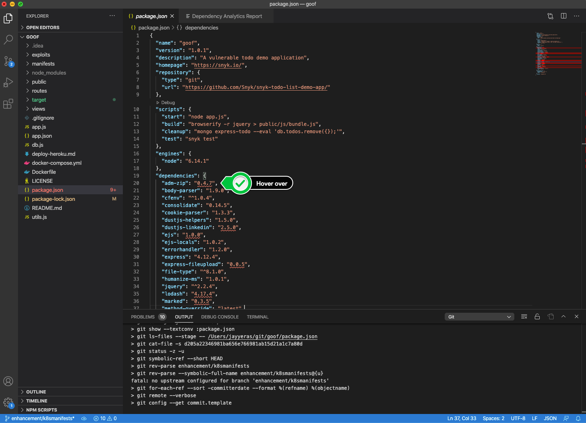
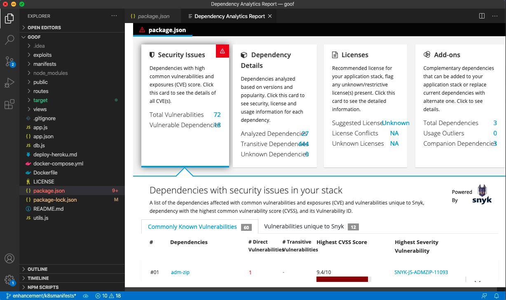
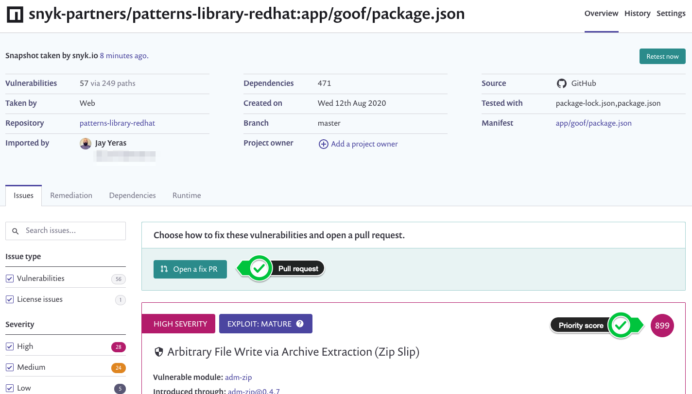
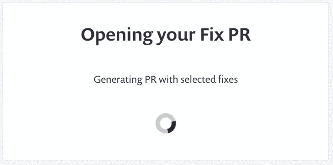

# Module 1

## Red Hat Dependency Analytics extension for Visual Studio Code

Once you have [installed](https://marketplace.visualstudio.com/items?itemName=redhat.fabric8-analytics&ssr=false#overview) the extension, opening or editing a manifest file \(`pom.xml` / `package.json` / `requirements.txt`\) within VSCode will scan your application with Snyk to identify security vulnerabilities in your dependencies. You can also right-click on a manifest file \(`pom.xml`/`package.json` / `requirements.txt`\) in the **VSCode File explorer** or **VSCode File editor** to display **Dependency Analytics Report** for your application.

### Finding vulnerabilities in application dependencies

Now, you can simply hover over the package version to get additional details.

The pop-up will provide you with immediate recommendations and the ability to either **Peek Problem** or **Quick Fix** to accept the recommended version upgrade.

If you select **Peek Problem** you are able to see a summarized view of the severity of the vulnerability as well as the recommendation.

Selecting **Quick Fix** will provide you with a second pop-up asking you to confirm switching to the recommended version.

Once confirmed, you will see that the version has been automatically changed to the recommended version in your manifest file.

### Understanding your findings and prioritizing fixes

When you open the manifest file you also have the ability to view the **Dependency Analytics Report** from within the IDE. This will appear as a pop-up window in the lower right-hand corner of your IDE with a button to click.

Clicking on the button will provide you with a summary of **Security Issues**, **Dependency Details**, and **License** issues. You also have the ability to view _Vulnerabilities unique to Snyk_ where you can sign in with your Snyk account to get additional insights and fix advice.

## Snyk Source Code Management \(SCM\) integrations

Snyk supports various [Git repository \(SCM\) integrations](https://support.snyk.io/hc/en-us/sections/360001138098-Git-repository-SCM-integrations). In these examples, we will focus on Snyk's [GitHub integration](https://support.snyk.io/hc/en-us/articles/360004032117-GitHub-integration). Snyk's GitHub integration allows you to continuously performs security scanning across all the integrated repositories, detect vulnerabilities in your open source components and provides automated remediation and upgrade fixes.

Once the integration is in place, you'll be able to enjoy the following capabilities:

### **1. Project level security reports**

Snyk will produce advanced security reports, allowing you to explore the vulnerabilities found in your repositories and fix them right away by opening a fix pull request directly to your repository, with the required upgrades or patches.

### **2. Projects monitoring and automatic fix pull requests**

Snyk will frequently scan your projects on either a daily or a weekly basis. When new vulnerabilities are found, it will notify you by email and by opening an automated pull requests with fixes to repositories. You also have the ability to manually **Open a fix PR**. In this example, we want to call attention to the **Priority score.** Snyk offers a [priority score](https://support.snyk.io/hc/en-us/articles/360009884837) to make the prioritization of issues as quick and easy as possible, allowing you to have the biggest impact with the least effort.

Once we decide to **Open a fix PR**, Snyk will calculate the appropriate fixes for vulnerabilities identified in your project and create the PR for you.


The process to generate the PR may take a minute or two.


Once complete, you will be redirected to your GitHub repository where you can review the _pull request_ and **approve**/**merge.**

