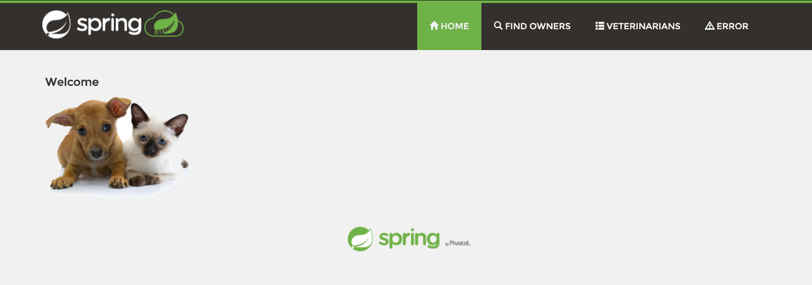

# Validate Kubernetes files with Snyk

## Validate Kubernetes files and deploy SPC to Kubernetes

Let's use the Snyk CLI to validate our Kubernetes files meet our security policies from the developer's environment. Assuming we are in the root folder of the SPC application, execute this command. The output will show any security issues Snyk has discovered and suggestions on how to fix the Kubernetes files.

### Test SPC Kubernetes YAML files

```text
snyk iac test kubernetes/petclinic-deployment.yaml
```



This scan will be immediate.


## Deploy SPC to Kubernetes

After a quick validation check of our Kubernetes files, let's complete our developer experience. We will deploy a Helm based MySQL instance and the SPC application. After the deployment is complete, we will send a simple request to validate our deployment.

The lab VM is configured with a Kubernetes cluster to deploy the SPC application. We have created alias commands for Kubectl \(k\) and Helm \(h\) to save your fingers from typing. We are also using a namespace called demo.

### Create a Kubernetes namespace

```text
k create namespace demo
```

### Deploy MySQL Database

```text
h install petclinic-db --set mysqlDatabase=petclinic stable/mysql --namespace demo
```

### Deploy SPC Kubernetes deployment

```text
k -n demo apply -f kubernetes/petclinic-deployment.yaml
```

```text
k -n demo apply -f kubernetes/petclinic-svc-nodeport.yaml
```

### Test SPC application

Validate the deployment using the SPC button at the top of your lab view.


Assuming all configuration is correct, the SPC button will show the SPC home page.



